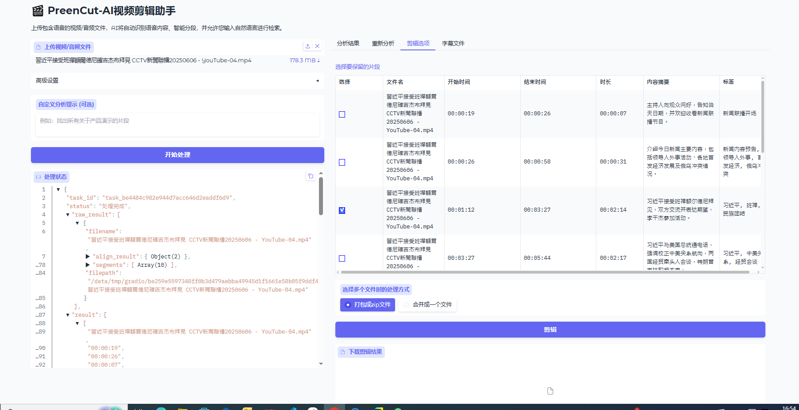

# 🎬 PreenCut - AI-Powered Video Clipping Tool

[](https://opensource.org/licenses/MIT)
[](https://www.python.org/downloads/)
[](https://gradio.app/)

PreenCut is an intelligent video editing tool that automatically analyzes audio/video content using speech recognition
and large language models. It helps you quickly find and extract relevant segments from your media files using natural
language queries.



## ✨ Key Features

- **Automatic Speech Recognition**: Powered by WhisperX for accurate transcription
- **AI-Powered Analysis**: Uses large language models to segment and summarize content
- **Natural Language Querying**: Find clips using descriptive prompts like "Find all product demo segments"
- **Smart Clipping**: Select and export segments as individual files or merged video
- **Batch Processing**: find a specific topic across multiple files
- **Re-analysis**: Experiment with different prompts without reprocessing audio

## ⚙️ Installation

1. Clone the repository:

```bash
git clone https://github.com/roothch/PreenCut.git
cd PreenCut
```

2. Install dependencies:

```bash
pip install -r requirements.txt
```

3. Install FFmpeg (required for video processing):

```bash
# ubuntu/Debian
sudo apt install ffmpeg

# CentOS/RHEL
sudo yum install ffmpeg

# macOS (using Homebrew)
brew install ffmpeg

# Windows: Download from https://ffmpeg.org/
```

4. Set up API keys (for LLM services):
First you need to set your llm services in LLM_MODEL_OPTIONS of `config.py`.
Then set your API keys as environment variables:

```bash
# for example, if you are using DeepSeek and DouBao as LLM services
export DEEPSEEK_V3_API_KEY=your_deepseek_api_key
export DOUBAO_1_5_PRO_API_KEY=your_doubao_api_key
```

## 🚀 Usage

1. Start the Gradio interface:

```bash
python main.py
```

2. Access the web interface at http://localhost:7860
3. Upload video/audio files (supported formats: mp4, avi, mov, mkv, ts, mxf, mp3, wav, flac)
4. Configure options:

  - Select LLM model
  - Choose Whisper model size (tiny → large-v3)
  - Add custom analysis prompt (Optional)

5. Click "Start Processing" to analyze content
6. View results in the analysis table:

  - Start/end timestamps
  - Duration
  - Content summary
  - AI-generated tags

7. Use the "Re-analyze" tab to experiment with different prompts
8. Use the "Cut" tab to select segments and choose export mode:

  - Export as ZIP package
  - Merge into a single video file

## 💻 Development
```bash
python3 -m uvicorn main:app --port 7860 --reload
```

## ⚡ Performance Tips

  - Adjust WHISPERX_BATCH_SIZE based on available VRAM
  - Reduce WHISPERX_MODEL_SIZE in config.py for faster processing
  - Use smaller model sizes for CPU-only systems

## 📜 License
This project is licensed under the MIT License. See the [LICENSE](LICENSE) file for details.

